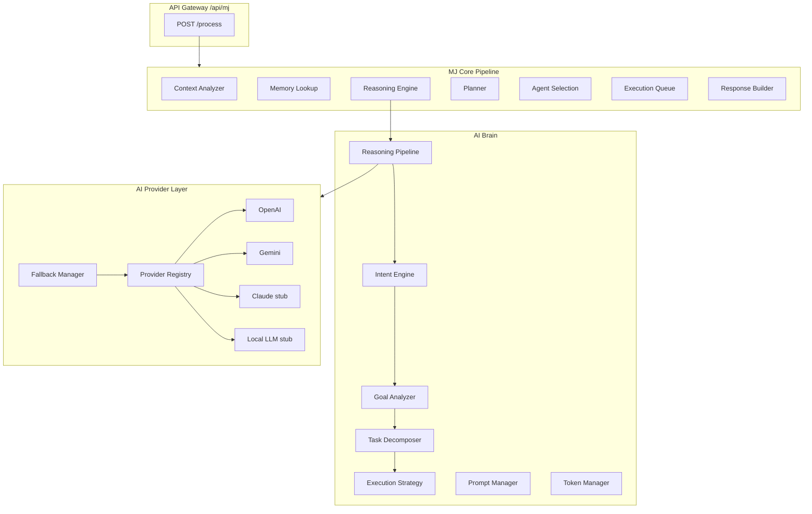

# MJ AI Brain — Architecture Guide (Sprint 3)

**Version:** 0.3.0-alpha  
**Status:** AI Brain & Reasoning Engine

MJ is no longer a chatbot stub. It operates as an **AI Chief Operating Officer** — every request is analyzed, planned, decomposed, and executed through a mandatory reasoning pipeline before any response is returned.

---

## System Architecture



---

## Reasoning Pipeline (Mandatory)

No AI response bypasses this pipeline.

```
Receive Request
    ↓
Intent Detection          → IntentEngine
    ↓
Goal Identification       → GoalAnalyzer
    ↓
Context Analysis
    ↓
Memory Lookup
    ↓
Constraint Analysis       → ConstraintAnalyzer
    ↓
Task Decomposition        → BrainTaskDecomposer
    ↓
Agent Planning            → ExecutionStrategy
    ↓
Priority Calculation
    ↓
Execution Strategy
    ↓
Response Generation       → AI Provider (via FallbackManager)
    ↓
Return Structured JSON    → AIResponseBuilder
```

### Reasoning Stages (Internal Thinking)

| Stage | Purpose |
|-------|---------|
| Understand | Classify intent |
| Research | Memory lookup |
| Evaluate | Constraint analysis |
| Compare | Agent strategy comparison |
| Plan | Task decomposition |
| Verify | Pre-response validation |
| Respond | Generate COO-level response |

---

## AI Provider Layer

### Supported Providers

| Provider | Status | Config Env |
|----------|--------|------------|
| OpenAI | Active | `OPENAI_API_KEY`, `MJ_OPENAI_MODEL` |
| Gemini | Active | `GEMINI_API_KEY`, `MJ_GEMINI_MODEL` |
| Claude | Architecture stub | `MJ_CLAUDE_API_KEY` |
| Local LLM | Architecture stub | `MJ_LOCAL_LLM_ENDPOINT` |
| Custom | Architecture stub | `MJ_CUSTOM_*` |

### Provider Selection (Config-Driven)

```env
MJ_AI_PROVIDER=openai          # Primary provider
MJ_AI_FALLBACK=gemini          # Fallback provider
MJ_AI_MAX_RETRIES=2
MJ_OPENAI_MODEL=gpt-4o-mini
MJ_GEMINI_MODEL=gemini-1.5-flash
```

Never hardcoded — selection via `MJConfig` → `ProviderSelector` → `FallbackManager`.

### Fallback Flow

```
Primary Provider fails
    ↓
Log failure + retry (exponential backoff)
    ↓
Switch to Fallback Provider
    ↓
If all fail → rule-based response (graceful degradation)
```

### Model Capabilities (Interfaces)

- Chat Completion ✅
- Structured JSON ✅
- Embeddings ✅ (OpenAI)
- Function Calling (interface ready)
- Streaming (interface ready)
- Image Understanding (interface ready)
- Video / Speech (future stubs)

---

## Intent Classification

16 intent types with confidence score:

`coding`, `research`, `learning`, `business`, `finance`, `marketing`, `automation`, `planning`, `conversation`, `deployment`, `reports`, `resume`, `creative`, `productivity`, `general`, `unknown`

Uses AI when provider available; rule-based keyword fallback when not.

---

## Structured AI Response Format

Every `/api/mj/process` response includes:

```json
{
  "reasoning": {
    "requestId": "req_...",
    "intent": { "type": "learning", "confidence": 0.8, "method": "rules" },
    "goal": {
      "primary": "...",
      "secondary": [],
      "requiredSkills": ["learning"],
      "complexity": "low",
      "riskLevel": "low",
      "executionType": "immediate"
    },
    "reasoningSummary": "[understand] Intent: learning → [plan] ... → [respond] ...",
    "executionPlan": {
      "type": "immediate",
      "tasks": [...],
      "executionGraph": { "sequential": [], "parallel": [], "dependent": [] },
      "estimatedTimeMinutes": 8,
      "taskCount": 3
    },
    "recommendedAgents": [
      { "type": "teacher", "reason": "Matched intent: learning" }
    ],
    "confidence": 0.8,
    "estimatedTime": "8 minutes",
    "response": "Executive-level COO response...",
    "warnings": [],
    "metadata": {
      "provider": "openai",
      "tokens": { "input": 120, "output": 450, "total": 570, "estimatedCost": 0.001 },
      "responseId": "ai_res_..."
    }
  }
}
```

---

## Prompt Manager

Centralized prompts — never embedded in controllers.

| Type | File | Purpose |
|------|------|---------|
| system | `brain/prompts/templates` | MJ COO identity |
| developer | templates | Code tasks |
| agent | templates | Multi-agent orchestration |
| learning | templates | Learning paths |
| research | templates | Research analysis |
| planning | templates | Strategic planning |
| report | templates | Report generation |
| resume | templates | Career guidance |

```javascript
const { getPromptManager } = require('./src/mj/brain/prompts')
getPromptManager().get('learning', { topic: 'React' })
```

---

## Token Management

Tracks per-request:
- Input / Output / Total tokens
- Estimated cost (model-specific rates)
- Execution time
- Future billing support

```javascript
const { getTokenManager } = require('./src/mj/brain/tokens/TokenManager')
getTokenManager().getTotals()
```

---

## Cache Layer (Architecture)

| Cache | Status | Purpose |
|-------|--------|---------|
| Prompt Cache | In-memory stub | Reuse compiled prompts |
| Response Cache | In-memory stub | Identical request dedup |
| Semantic Cache | Stub | Future vector similarity |
| Redis | Not connected | Future production cache |

---

## Observability

`AIObservability` tracks:
- Request latency
- Token usage
- Provider used
- Retries & errors
- Pipeline stage timings
- Agent selections

```bash
curl http://localhost:5001/api/mj/health
# → payload.aiBrain.observability
```

---

## Security

| Protection | Component |
|------------|-----------|
| Prompt injection | `PromptGuard` — pattern detection & neutralization |
| API key leak | Output redaction (`sk-*` patterns) |
| Malformed input | Validation + sanitization |
| Rate limits | Gateway rate limiter (unchanged) |
| API keys | Env vars only — never logged |

---

## Folder Structure

```
server/src/mj/
├── ai/                          # Provider layer
│   ├── providers/               # OpenAI, Gemini, stubs
│   ├── interfaces/              # IAIProvider, capabilities
│   ├── ProviderRegistry.js
│   ├── FallbackManager.js
│   └── ProviderSelector.js
├── brain/
│   ├── ReasoningPipeline.js     # 12-stage reasoning
│   ├── ReasoningEngine.js       # Entry point
│   ├── AIBrain.js               # Orchestrator
│   ├── IntentEngine.js
│   ├── GoalAnalyzer.js
│   ├── ConstraintAnalyzer.js
│   ├── TaskDecomposer.js
│   ├── ExecutionStrategy.js
│   ├── prompts/                 # PromptManager + templates
│   ├── tokens/                  # TokenManager
│   ├── observability/           # Metrics
│   ├── security/                # PromptGuard
│   ├── cache/                   # AICacheLayer
│   └── response/                # AIResponseBuilder
```

---

## Environment Variables

```env
# AI Provider
OPENAI_API_KEY=sk-...
GEMINI_API_KEY=...
MJ_AI_PROVIDER=openai
MJ_AI_FALLBACK=gemini
MJ_OPENAI_MODEL=gpt-4o-mini
MJ_GEMINI_MODEL=gemini-1.5-flash

# Optional future
MJ_CLAUDE_API_KEY=
MJ_LOCAL_LLM_ENDPOINT=
MJ_RATE_LIMIT=60
MJ_API_KEY=                        # Gateway API key
```

---

## Graceful Degradation

When no AI provider is configured:
1. Rule-based intent classification (keyword matching)
2. Heuristic goal analysis
3. Template task decomposition (3 tasks)
4. Agent recommendation from intent map
5. Structured fallback COO response explaining provider setup

**Zero runtime errors** — MJ always returns structured JSON.

---

## What Did NOT Change

- Dream Wave auth, routes, MongoDB, Firebase, UI
- Existing `/api/auth`, `/api/ai`, etc.
- Port 5001
- Gateway endpoints (enhanced response payload only)
