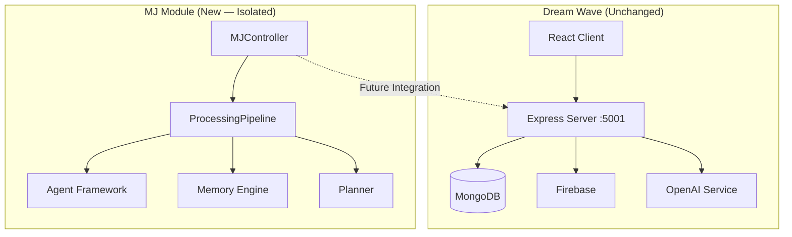
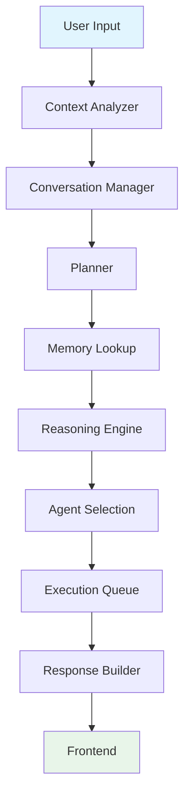
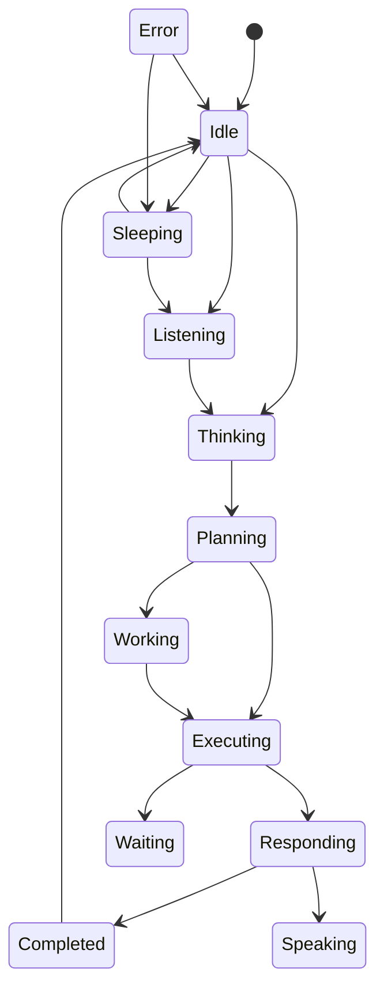
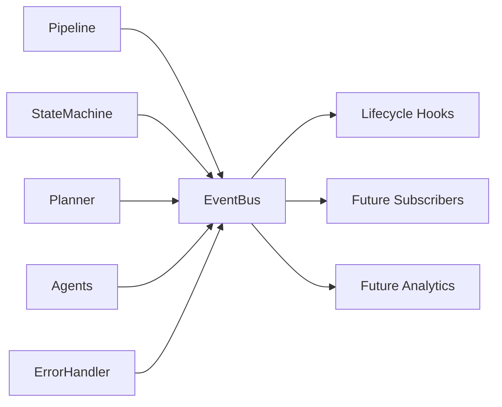
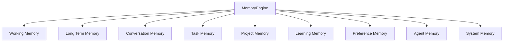
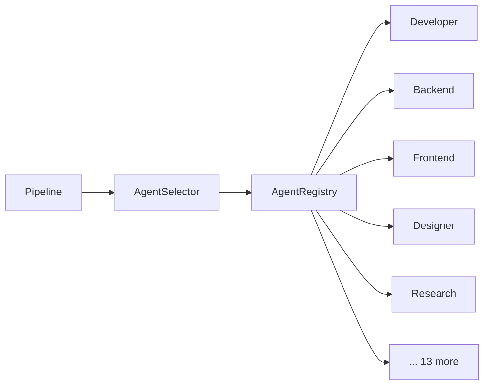
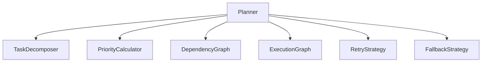
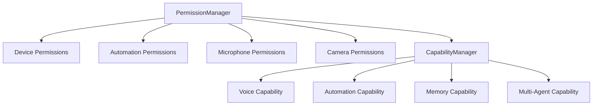
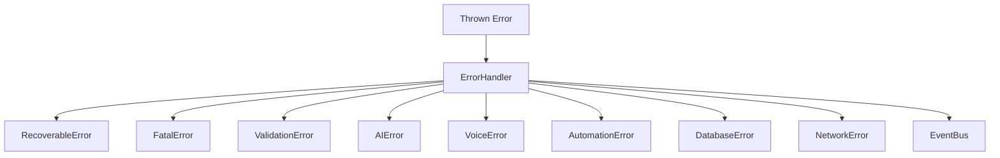

# MJ Architecture Guide

## System Context

MJ sits as an isolated module within the Dream Wave backend. It does not replace or modify any existing Dream Wave subsystem.



---

## Central Processing Pipeline

**Rule:** Every future request MUST flow through this pipeline. Nothing bypasses it.



### Stage Responsibilities

| Stage | Component | Current Status |
|-------|-----------|----------------|
| User Input | Pipeline entry | Stub — accepts command object |
| Context Analyzer | `context/ContextAnalyzer` | Stub — builds session context |
| Conversation Manager | `conversation/ConversationManager` | Stub — session tracking |
| Planner | `planner/Planner` | Stub — plan structure only |
| Memory Lookup | `memory/MemoryEngine` | Stub — returns empty array |
| Reasoning Engine | `brain/ReasoningEngine` | Stub — no AI calls |
| Agent Selection | `agents/AgentSelector` | Stub — selects first agent |
| Execution Queue | `services/ExecutionQueue` | Stub — processes empty queue |
| Response Builder | `services/ResponseBuilder` | Stub — builds response envelope |
| Frontend | Pipeline exit | Stub — delivery ready signal |

---

## State Machine

MJ operates as a finite state machine with 14 states and validated transitions.



### States

| State | Purpose |
|-------|---------|
| `idle` | Ready, awaiting input |
| `sleeping` | Low-power mode |
| `listening` | Awaiting voice input (future) |
| `thinking` | Processing input |
| `planning` | Creating execution plan |
| `working` | General work state |
| `executing` | Running tasks/agents |
| `learning` | Learning mode (future) |
| `researching` | Research mode (future) |
| `speaking` | Voice output (future) |
| `waiting` | Awaiting external input |
| `responding` | Building response |
| `completed` | Task complete |
| `error` | Error recovery state |

---

## Event Bus

Centralized pub/sub for decoupled communication.



### Events

| Event | Emitted When |
|-------|-------------|
| `mj:started` | MJ.start() called |
| `mj:stopped` | MJ.stop() called |
| `mj:sleep` | MJ.sleep() called |
| `mj:wake` | MJ.wake() called |
| `mj:command:received` | Command enters pipeline |
| `mj:context:analyzed` | Context analysis complete |
| `mj:memory:found` | Memory lookup complete |
| `mj:plan:created` | Plan generated |
| `mj:agent:selected` | Agent chosen for task |
| `mj:task:started` | Execution begins |
| `mj:task:completed` | Execution complete |
| `mj:task:failed` | Execution failed |
| `mj:voice:started` | Voice output begins (future) |
| `mj:voice:stopped` | Voice output ends (future) |
| `mj:notification:created` | Notification sent (future) |
| `mj:error:occurred` | Error handled |
| `mj:state:changed` | State transition |
| `mj:pipeline:stage` | Pipeline stage entered |

---

## Memory Architecture

Nine memory store interfaces — implementation deferred to future sprints.



All stores implement `IMemoryStore`: `store()`, `retrieve()`, `search()`, `clear()`, `count()`.

---

## Agent Framework

18 pre-defined agent types with a registration system.



All agents implement `IAgent`: `execute()`, `isAvailable()`, `toDescriptor()`.

---

## Planner Architecture



Supports future multi-agent planning via `multiAgentReady` flag on plans.

---

## Security Architecture



---

## Performance Architecture

| Component | Purpose |
|-----------|---------|
| `ExecutionQueue` | Async task queue with FIFO processing |
| `CacheService` | TTL-based in-memory cache |
| `StreamService` | EventEmitter-based streaming channels |
| `ParallelExecutor` | Batch parallel execution with concurrency limits |

---

## Error System



---

## Config System

Prepared schemas (not connected):

- OpenAI, Gemini, Google Veo, ElevenLabs
- Local Automation, Voice, Memory, Agents
- Database, Security

Access via `MJ.config.getConfig()` or `MJ.config.get('openai')`.

---

## Bootstrap Sequence

```
1. Load config schemas
2. Initialize EventBus (singleton)
3. Initialize ErrorHandler (singleton)
4. Create StateMachine (idle)
5. Create MemoryEngine (9 stores)
6. Create Planner
7. Create AgentRegistry (18 agents)
8. Create performance services
9. Create security managers
10. Create LifecycleHooks
11. Wire ProcessingPipeline with all dependencies
```

---

## Data Flow Example

```
User: "Help me build a React component"
  │
  ▼
MJController.processCommand("Help me build a React component")
  │
  ▼
createCommand() → { id, input, timestamp }
  │
  ▼
ProcessingPipeline.execute(command)
  │
  ├─ ContextAnalyzer → { sessionId, userId, intent: null }
  ├─ ConversationManager → append to session
  ├─ Planner → { planId, tasks: [], graphs }
  ├─ MemoryEngine.lookup() → []
  ├─ ReasoningEngine.reason() → { conclusion: null }
  ├─ AgentSelector.select() → developer agent
  ├─ ExecutionQueue.process() → []
  └─ ResponseBuilder.build() → { id, content: "", success: true }
  │
  ▼
Return { success: true, context, response }
```
